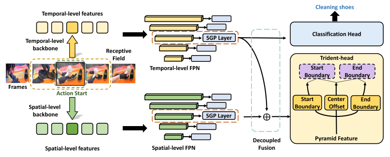
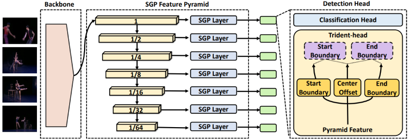
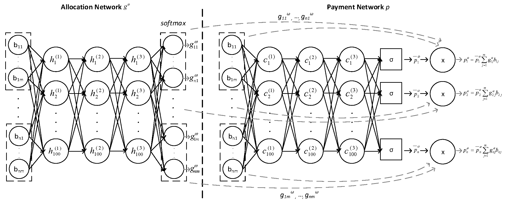
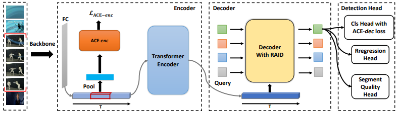
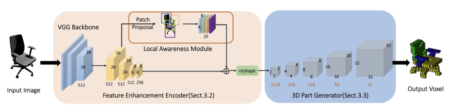

# About Me

I am a PhD student at the State Key Laboratory of Virtual Reality Technology and Systems, Beihang University. I am being supervised by Prof. <a href="https://ieeexplore.ieee.org/author/37086553313">Haogang Zhu</a> and Prof. <a href="https://jian-cheng.org/">Jian Cheng</a>. My research interests include computer vision, video understanding, detection and large language model (LLM). Prior to this, I obtained my Bachelor's degree from Xidian University in 2019.
I am currently working as a research intern at JD Explore Academy.

[//]: # (with)

[//]: # (<a href="https://qiongcao.github.io/">Qiong Cao</a>,)

[//]: # (<a href="https://y-zhong.info/">Yujie Zhong</a>)

[//]: # (and)

[//]: # (<a href="https://scholar.google.com/citations?user=RwlJNLcAAAAJ&hl=zh-CN">Dacheng Tao</a>.)

 <a href="https://scholar.google.com/citations?user=e8bIW37RkFkC&hl=zh-CN&oi=ao">[Google Scholar]</a>, 
 <a href="https://github.com/dingfengshi">[Github]</a>, 
 <a href="mailto:shidingfeng@buaa.edu.cn">[Email]</a>.

# News

- [2023.02.27] **One** paper is accepted at **CVPR 2023**
- [2022.09.15] **One** paper is accepted at **NeurIPS 2022**
- [2022.07.09] **One** paper is accepted at **ECCV 2022**
- [2020.03.06] **One** paper is accepted at **ICME 2020**

# Publications

<table width="100%" align="center" border="1" cellspacing="0" cellpadding="12" style="border-color: transparent;">
<tbody>

<tr>
<td width="20%" valign="baseline">

</td>
<td width="80%" valign="middle">

<b>Temporal Action Localization with Enhanced Instant Discriminability</b> 
<i><b>Dingfeng Shi</b>, Qiong Cao, Yujie Zhong, Shan An, Jian Cheng, Haogang Zhu, Dacheng Tao</i>

<b>
Arxiv, 2023.  
<a href="https://arxiv.org/abs/2309.05590">[PDF]</a>
</b>

</td>
</tr>

<tr>
<td width="20%" valign="baseline">

</td>
<td width="80%" valign="middle">

<b>TriDet: Temporal Action Detection with Relative Boundary Modeling</b> 
<i><b>Dingfeng Shi</b>, Yujie Zhong, Qiong Cao, Lin Ma, Jia Li, Dacheng Tao</i>

<b>
IEEE Conference on Computer Vision and Pattern Recognition (CVPR), 2023.  
<a href="https://arxiv.org/abs/2303.07347">[PDF]</a>
<a href="https://github.com/dingfengshi/TriDet">[CODE]</a>
</b>

</td>
</tr>

<tr>
<td width="20%" valign="baseline">

</td>
<td width="80%" valign="middle">
<b>Benefits of Permutation-equivariance in Auction Mechanisms</b> 
<i>Tian Qin, Fengxiang He, <b>Dingfeng Shi</b>, Wenbing Huang, Dacheng Tao</i>

<b>
Neural Information Processing Systems (NeurIPS), 2022.  
<a href="https://arxiv.org/abs/2210.05579">[PDF]</a>
<a href="https://github.com/dingfengshi/Auction_PE">[CODE]</a>
</b>

</td>
</tr>

<tr>
<td width="20%" valign="baseline">

</td>
<td width="80%" valign="middle">
<b>ReAct: Temporal Action Detection with Relational Action Queries</b> 
<i><b>Dingfeng Shi</b>, Yujie Zhong, Qiong Cao, Jing Zhang, Lin Ma, Jia Li and Dacheng Tao</i>

<b>
European Conference on Computer Vision (ECCV), 2022.  
<a href="https://www.ecva.net/papers/eccv_2022/papers_ECCV/papers/136700102.pdf">[PDF]</a>
<a href="https://github.com/dingfengshi/React">[CODE]</a>
</b>

</td>
</tr>

<tr>
<td width="20%" valign="baseline">

</td>
<td width="80%" valign="middle">
<b>Reconstructing Part-level 3D Models from a Single Image</b> 
<i><b>Dingfeng Shi</b>, Yifan Zhao, Jia Li</i>

<b>
IEEE International Conference on Multimedia and Expo (ICME), 2020.  
<a href="http://cvteam.net/projects/2020/ICME/ICME2020_files/ICME2020-paper.pdf">[PDF]</a>
</b>

</td>
</tr>
</tbody>
</table>

# Academic Services
I serve as a reviewer for TPAMI, CVPR, ICCV, ECCV, NeurIPS, AAAI, TMM and TCSVT.
